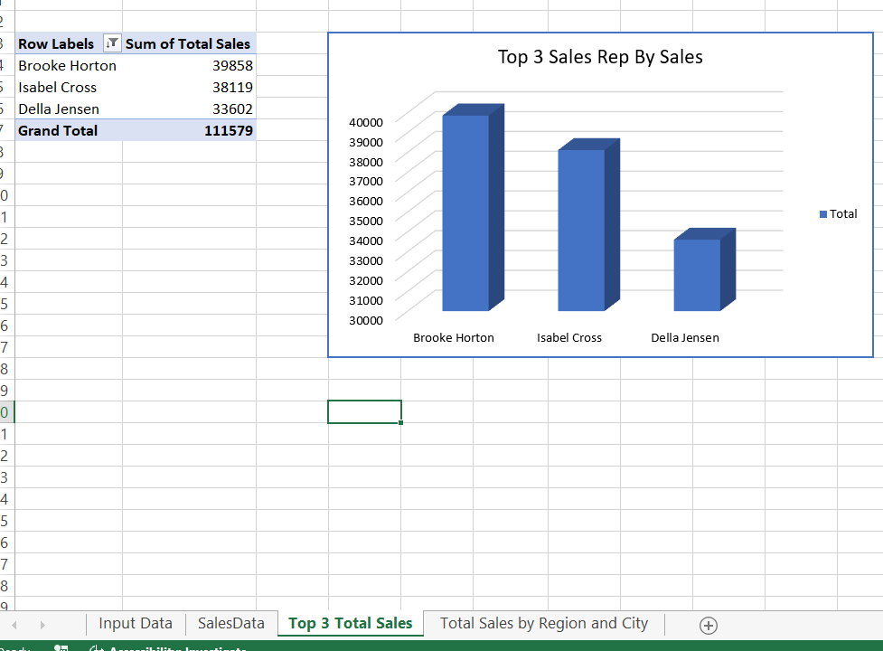
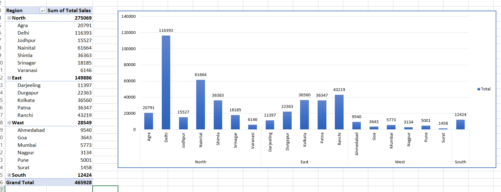
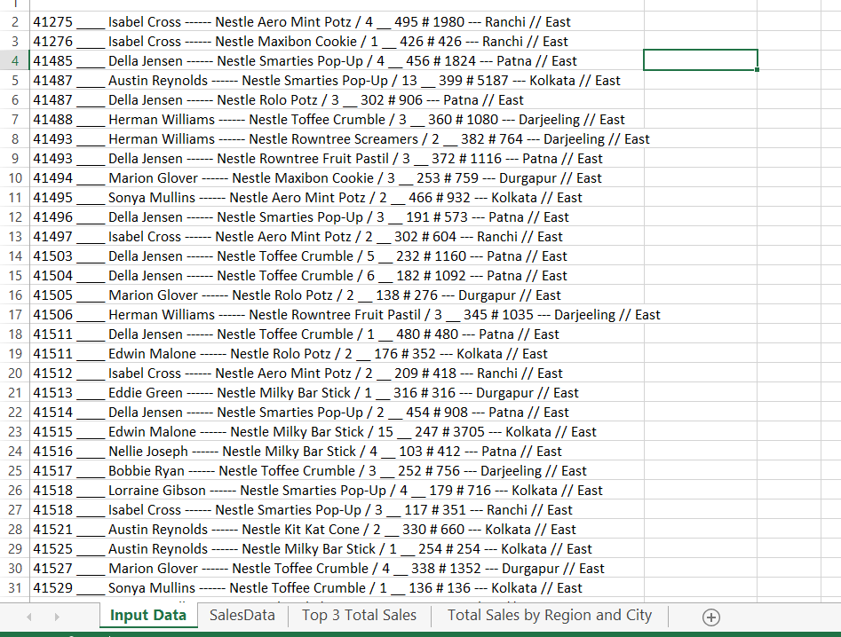
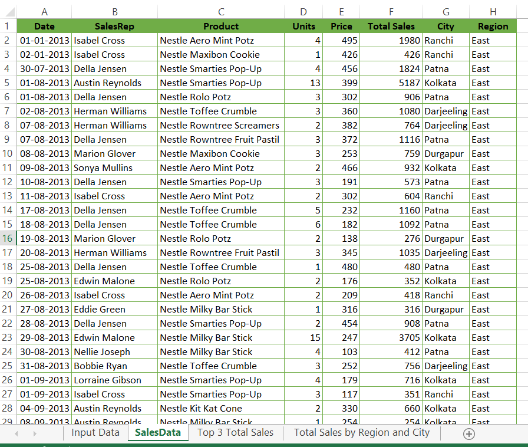

# 📊 PDF to Excel Sales Analysis Project

This project extracts sales data from a PDF file and converts it into a structured Excel dashboard.
It includes automated cleaning, formatting, and data visualization of Sales Data (2013 & 2014).

## 🔍 Project Overview

* The original sales data was provided in PDF format.

* The data was transformed into a clean tabular structure using Excel.

* Multiple dashboards and pivot tables were built to analyze:

* Top 3 Sales Representatives

  * **Total Sales by Region**

  * **Total Sales by City**

  * **Product-wise Sales**

  * **Year-wise performance**

## 📁 Files Included
| File                                       | Description                                         |
| ------------------------------------------ | --------------------------------------------------- |
| `PDF TO Excel project.xlsx`                | Final Excel workbook with dashboards & pivot tables |
| `Sales Data for 2013 & 2014.pdf` | Original PDF sales data                             |
| `/Screenshots`                             | Dashboard and sheet previews                        |

## 📊 Dashboards Included
### 1️⃣ Top 3 Sales Representatives

* Identifies the highest revenue contributors

* Chart type: 3D Column Chart

📸 Preview:

### 2️⃣ Total Sales by Region and City

* Region-wise comparison (North, East, West, South)

* City-level breakdown with bar charts

📸 Preview:

### 3️⃣ Raw Data (Converted from PDF)

Cleaned with Date, SalesRep, Product, Units, Price, Total Sales, City, Region

Ensures accuracy for pivot table analysis

**Before**:

**After**:

## 🛠 Tools Used

* **Microsoft Excel**

* Pivot Tables & Pivot Charts

* PDF to Excel Data Cleaning

* Excel Formulas

* Dashboard Design & Formatting
